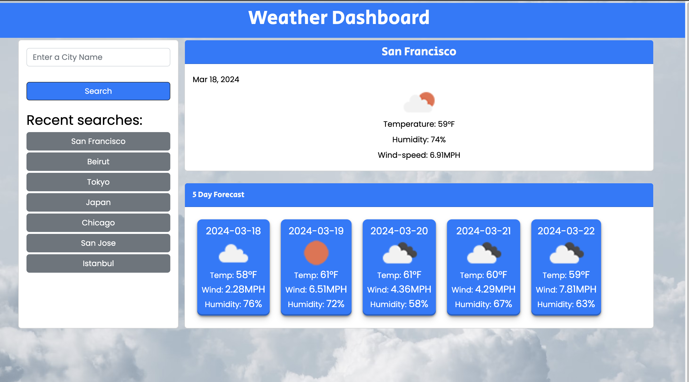

# Weather Dashboard

This weather dashboard is designed to help travelers plan their trips by providing current and future weather outlook for multiple cities. Users can search for a city and view its current weather conditions as well as a 5-day forecast. Additionally, the search history is maintained for easy access to previously searched cities.

## Features

- Search for a city to view its current and future weather conditions.
- Current weather conditions include the city name, date, weather icon, temperature, humidity, and wind speed.
- Future weather conditions display a 5-day forecast with the date, weather icon, temperature, wind speed, and humidity.
- Access previous search history to quickly view weather conditions for previously searched cities.

## Preview

## Usage

1. Visit the link https://chadoyek.github.io/Weather-Dashboard/ in your preferred web browser.
2. Enter the name of a city in the search input and click the search button or press Enter.
3. View the current weather conditions and the 5-day forecast for the searched city.
4. To view weather conditions for a previously searched city, click on the city in the search history.

## Technologies Used

- HTML
- CSS
- JavaScript
- OpenWeatherMap API (for weather data)

## Credits

This project was created by Chadi Hoyek

